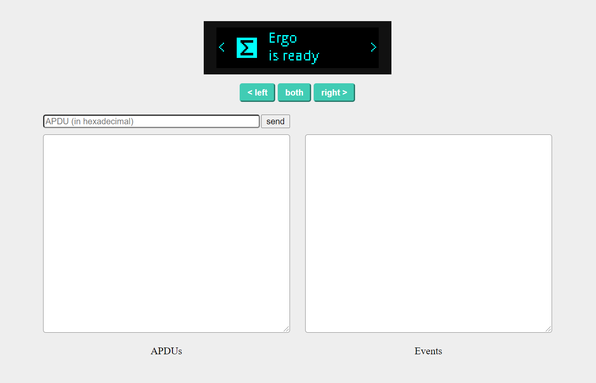

# ergo-ledger-dev

Get a local environment setup for testing the ergo ledger app using the [speculos](`https://github.com/LedgerHQ/speculos`) emulator.

This is useful for developing integrations with the ergo ledger app and if you don't own a ledger device.

## Prerequisites

- `git`
- `docker` / `docker-compose`

## Setup

1. Clone this repository including submodules:

```sh
$ git clone --recurse-submodules
```

2. Compile the ergo ledger app:

```sh
$ docker-compose up compiler
```

You should now have the compiled app in `leder-app-ergo/bin` if all went well.

3. Run the emulator

```sh
$ docker-compose up emulator
```

4. Access the emulator via browser `127.0.0.1:5000`



## Info

Braindumpy so I don't forget, will tidy this up later.

We can interact with the emulated ergo app from the browser using [http transport](https://github.com/LedgerHQ/ledgerjs/tree/master/packages/hw-transport-http). The http class in that repository is slightly off for interacting with the emulator.
It uses `apduHex` for the payload but the `speculos` http server expects it in the `data` property.

If you're using nodejs this transport would likely be a better option: `https://github.com/LedgerHQ/ledgerjs/tree/master/packages/hw-transport-node-speculos`

```js
const ergo = new ErgoApp(new HttpTransport('http://127.0.0.1:5000/apdu'), 0);
```
